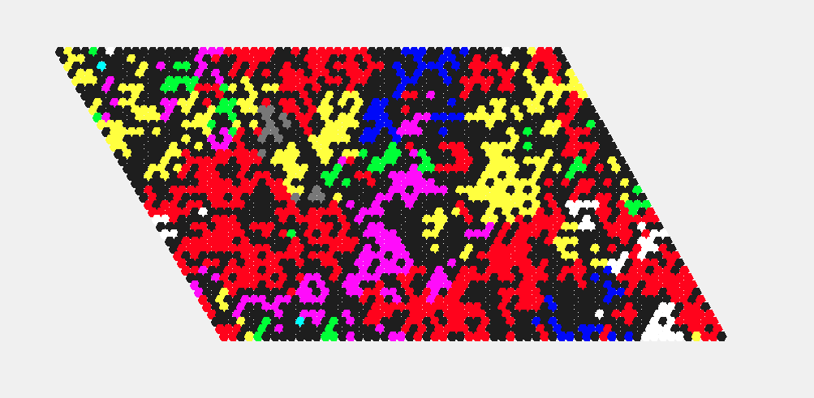
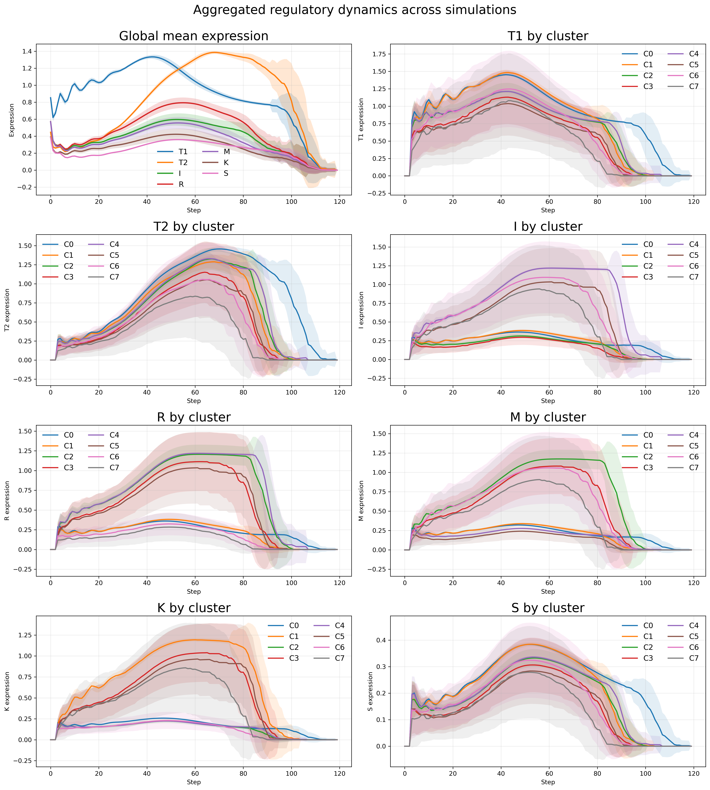
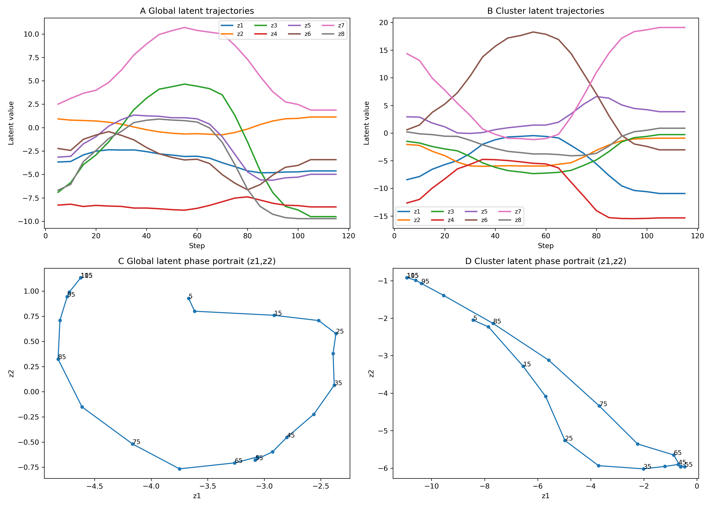
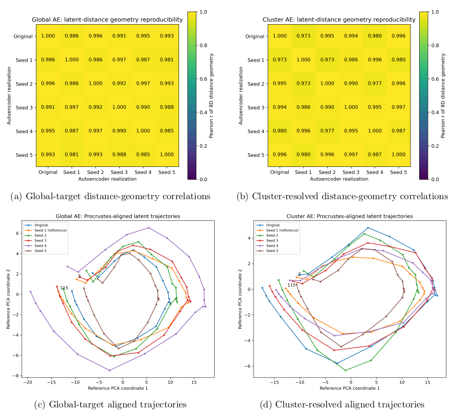

# Evoscope

**Evoscope v0.9.3**  
*A minimal regulatory spatial model for emergent multicellular organization.*

**Author:** Luca Zammataro  
**Organization:** Lunan Foldomics LLC

Evoscope is a Python package for simulating emergent multicellular organization from a minimal regulatory grammar coupling nutrient uptake, adhesion, motility, competition, protection, and heritable identity commitment on a toroidal hexagonal lattice.

This repository contains the version aligned with the revised manuscript and supplementary representation-control analyses.

---

**Evoscope** is a minimal computational framework for studying how multicellular organization, morphology, and functional diversity can emerge from compact regulatory rules in a dissipative environment.

The framework is built around a spatial agent-based model in which cells evolve on a toroidal hexagonal lattice coupled to a nutrient field. Each cell is governed by a compact regulatory program controlling nutrient uptake, adhesion, motility, competition, protection, and identity commitment. Despite this minimal design, the system generates rich multicellular behaviors, including aggregate formation, territorial expansion, differentiated colonies, ecological trade-offs, collective movement, and eventual collapse under stress.

A central idea behind Evoscope is that multicellular form is not merely a visible outcome, but a **mesoscopic state** linking intracellular regulation to tissue-scale organization. To explore this, Evoscope also serves as a controlled testbed for **representation learning**: autoencoders are trained on simulation snapshots to test whether morphology alone retains partial, recoverable information about the internal regulatory state that generated it.

In this sense, Evoscope serves two purposes at once:

- a minimal sandbox for emergent multicellular dynamics;
- a synthetic benchmark for testing whether latent-variable models can identify mesoscopic structure in systems where the internal rules are known.

More broadly, the project is motivated by the hypothesis that if these approaches work in a fully controlled synthetic system, they may also become useful in real biological settings where sufficiently rich paired morphological and spatial-transcriptomic data are available.

The model combines:

- heritable identity commitment;
- nutrient-dependent regulation;
- adhesion, motility, competition, and protection;
- local killing and space clearing;
- emergent multicellular morphologies;
- morphology-to-state inference through autoencoder-based latent representations.

Rather than modeling a specific organism, Evoscope provides a **minimal regulatory sandbox** for exploring how structured multicellular behaviors can arise from interpretable local rules.

---

## Concept

Evoscope was developed to investigate a specific question:

> Can a minimal multicellular system generate a biologically interpretable **mesoscopic level of organization** linking intracellular regulatory programs to transient colony-level structure?

The simulation represents cells as agents on a **toroidal hexagonal lattice** coupled to a shared nutrient field. Each cell carries a compact internal regulatory program that biases its local behavior and long-term identity.

---

## Demo video

Video overview:  
https://www.youtube.com/watch?v=tgj-fxmyyas

[](https://www.youtube.com/watch?v=tgj-fxmyyas)

---

## What Evoscope simulates

Evoscope models a population of cells that:

- live on a toroidal hexagonal lattice;
- consume and compete for diffusible nutrients;
- proliferate, die, move, and interact locally;
- commit to heritable identity states;
- form differentiated clusters (numbered from 0 to 7) with distinct collective behaviors.

These interactions give rise to dynamic multicellular regimes rather than static structures: colonies form, expand, specialize, compete, drift, and eventually dissolve as ecological constraints accumulate.

---

## Main features

- 2D toroidal hexagonal grid;
- one cell per lattice site;
- diffusive extracellular nutrient field;
- intracellular energy bookkeeping;
- minimal gene/protein regulatory system;
- stochastic commitment to cluster identity;
- division, movement, attack, death, and nutrient recycling;
- ASCII rendering of simulation states;
- exportable outputs for downstream quantitative analysis;
- support for morphology-to-state learning with convolutional autoencoders.

---

## Why this project matters

Evoscope was designed to build a synthetic multicellular world that is simple enough to remain interpretable, yet rich enough to generate structured morphodynamic regimes that can be learned by convolutional encoders.

It is not intended to reproduce any specific organism. Instead, it asks a more fundamental question:

> Can a minimal regulatory grammar generate multicellular states rich enough to be both biologically meaningful and computationally learnable?

This makes Evoscope relevant both to theoretical biology and to the development of machine-learning strategies aimed at connecting morphology, regulation, and latent mesoscopic structure.


## Repository structure

The repository is organized around the `code/` directory, which contains both the installable Evoscope package and the standalone workflow scripts used in the manuscript analyses.

- `code/evoscope/` — installable Python package containing the core simulation framework, command-line interface, data exporters, autoencoder utilities, latent-space analysis, correlation analysis, plotting, and visualization modules.
- `code/correlation_global_or_cluster_latents_and_genes.py` — standalone workflow script for latent–observable correlation analysis.
- `code/aggregate_evoscope.py` — standalone workflow script for aggregating simulation outputs across runs.
- `code/viewer.py` — interactive viewer for inspecting simulation snapshots.
- `code/pyproject.toml` — package metadata and installation configuration.
- `examples/` — random-seed simulation utilities and example outputs.
- `analysis/representation_controls/` — held-out seed, baseline-control, and latent temporal prediction analyses added for the revised manuscript and Supplementary Information.

The reusable package API is contained in `code/evoscope/`, while selected top-level scripts in `code/` are retained as explicit manuscript-analysis and visualization workflows.


---

## Installation

Clone the repository and install the required Python packages:

```bash
git clone https://github.com/lunanfoldomics/evoscope.git
```

## Conda environment

You can also create a Conda environment for Evoscope:

```bash
conda env create -f environment.yml
conda activate evoscope
```

The revised Evoscope codebase is distributed as an installable Python package.
From the `code/` directory, install in editable mode:

```bash
python -m pip install -e .
```

---

## Running a simulation

After installing the package, a simulation can be launched directly from the command line.
The representative simulation used in the manuscript can be reproduced with:


```bash
evoscope --width 60 --height 40 --seed 42 --epochs 120 --initial_cells 30 --nutrient 6.9 --outdir runs/seed_42
```

or

```bash
python -m evoscope.cli --width 60 --height 40 --seed 42 --epochs 120 --initial_cells 30 --nutrient 6.9 --outdir runs/seed_42
```

Each run exports:

- ASCII frame dumps
- snapshot arrays
- global_genes.csv (global gene trajectories)
- cluster_genes.csv (cluster-resolved gene trajectories)
- population_metrics.csv

Example for multiple random seeds:
```bash
evoscope --width 60 --height 40 --seed 38 --epochs 120 --initial_cells 30 --nutrient 6.9 --outdir runs/seed_38
evoscope --width 60 --height 40 --seed 40 --epochs 120 --initial_cells 30 --nutrient 6.9 --outdir runs/seed_40
evoscope --width 60 --height 40 --seed 53 --epochs 120 --initial_cells 30 --nutrient 6.9 --outdir runs/seed_53
```

### Example output

Typical simulation dynamics include:

- sparse exploratory cells
- early nucleation of committed clusters
- coexistence of multiple multicellular domains
- competitive reshaping of territorial interfaces
- fragmentation and collapse under energetic stress


The system is intentionally minimal, but it often produces visually rich and interpretable multicellular behaviors.

---

## Interactive viewer

Evoscope also includes a `pygame`-based interactive viewer for inspecting simulation snapshots at high resolution.

If launched from a directory containing the snapshot files of a simulation run, the viewer allows you to:

- browse simulation frames interactively;
- move forward and backward through time;
- pause and resume playback;
- monitor the currently displayed frame;
- inspect multicellular morphologies in a high-resolution visual format;
- facilitate figure generation for manuscripts and supplementary materials.

To launch the viewer for runs/seed_42/:

```bash
cd runs/seed_42/
python ../../code/viewer.py
```




*Example of the Evoscope high-resolution interactive viewer for navigating simulation frames and inspecting multicellular spatial organization (epoch 45).*

ASCII snapshots remain particularly useful for interpreting cluster identities and domain boundaries, whereas the high-resolution viewer is more useful for visual exploration and figure generation.

---

## Multi-run aggregation

Run `aggregate_evoscope.py` from the repository root, or from the directory containing the `runs/` folder with your simulation outputs:

```bash
python code/aggregate_evoscope.py --root runs --outdir runs/aggregated_outputs
```

Here, `--root runs` points to the directory containing the individual simulation folders, and `--outdir runs/aggregated_outputs` specifies where the aggregated outputs will be written.

This can be used to compute:

mean ± standard deviation of global gene trajectories;
mean ± standard deviation of cluster-resolved gene trajectories;
multi-experiment summary figures.


### Example aggregation outputs

The figure below summarizes the aggregated temporal dynamics obtained from multiple independent Evoscope simulations performed under identical global parameters while varying only the random seed. The upper-left panel reports the global mean trajectories of the seven regulatory variables, whereas the remaining panels show the corresponding cluster-resolved trajectories for each regulatory variable. Solid lines represent the mean across simulations and shaded regions indicate ±1 standard deviation.



These aggregated dynamics illustrate that Evoscope produces reproducible temporal regulatory programs across independent simulations rather than idiosyncratic single-run behaviors.

---

## Autoencoders

Evoscope supports two autoencoder workflows for latent-variable discovery:

* **global-gene mode**
* **cluster-gene mode**

### Global-gene mode

```bash
python -m evoscope.autoencoder \
	--snapshots_dir runs/seed_42/snapshots \
	--global_csv runs/seed_42/global_genes.csv  \
	--target_mode global \
	--epochs 100 \
	--outdir runs/seed_42/global_ae_outputs
```

### Cluster-gene mode

```bash
python -m evoscope.autoencoder  \
	--snapshots_dir runs/seed_42/snapshots \
	--cluster_csv runs/seed_42/cluster_genes.csv \
	--target_mode cluster_flat \
	--epochs 100  \
	--outdir runs/seed_42/cluster_ae_outputs
```

### Latent–gene correlation analysis

Each autoencoder run produces an output folder: 

* `global_ae_outputs` for global-gene runs
* `cluster_ae_outputs` for cluster-gene runs

Then run the correlation script.

**Global-gene correlation**

```bash
python code/correlation_global_or_cluster_latents_and_genes.py \
	--latents runs/seed_42/global_ae_outputs/latents.csv \
	--metrics runs/seed_42/global_genes.csv \
	--outfile runs/seed_42/global_ae_outputs/global_latent_heatmap.png \
	--title Global_Latent_Heatmap
```

**Cluster-gene correlation**

```bash
python code/correlation_global_or_cluster_latents_and_genes.py  \
    --latents runs/seed_42/cluster_ae_outputs/latents.csv \
    --metrics runs/seed_42/cluster_genes.csv \
	--outfile runs/seed_42/cluster_ae_outputs/cluster_latent_heatmap.png \
	--title Cluster_Latent_Heatmap
```

This analysis typically produces:
- correlation tables linking latent coordinates to gene-level observables;
- heatmap visualizations summarizing latent–observable relationships;
- output files that can be compared across independent simulation seeds.

### Example correlation outputs

Representative examples of latent–gene correlation heatmaps are shown below for the global-gene and cluster-gene workflows.


This workflow produces correlation tables and heatmap visualizations that summarize the relationship between learned latent coordinates and observable regulatory variables. Representative examples from the Evoscope analyses are shown above and are discussed further in the associated preprint.


### Temporal organization of morphology-derived latent representations

Figure 5 of the associated manuscript (see citation below) illustrates the temporal organization of the morphology-derived latent representations learned from the representative seed-42 Evoscope simulation. 
The figure compares the latent trajectories obtained from the global-target and cluster-resolved autoencoders.




The manuscript Figure 5 can be regenerated directly from the corresponding autoencoder latent outputs:

```bash
python code/plot_figure5.py \
  --global_latents runs/seed_42/global_ae_outputs/latents.csv \
  --cluster_latents runs/seed_42/cluster_ae_outputs/latents.csv \
  --outfile runs/seed_42/Figure5.png
```

The plotting script reconstructs the four-panel visualization reported in the manuscript, showing the temporal evolution of the learned latent coordinates and the corresponding two-dimensional trajectory projections for the global-target and cluster-resolved representations.

For this analysis, morphology snapshots from the representative seed-42 simulation were recorded every five simulation epochs (--snapshot_every 5). The resulting latent trajectories therefore correspond to the sampled temporal sequence used to generate Figure 5.


### Robustness of latent temporal organization to autoencoder initialization

The robustness of morphology-derived latent representations to autoencoder initialization can be evaluated by training multiple independently initialized autoencoder models under otherwise identical conditions.

Because independently trained autoencoders are not expected to recover identical latent coordinate systems, reproducibility is not assessed by requiring direct axis-by-axis correspondence between z1, z2, ..., z8. Instead, the analysis tests whether the relational geometry of the complete morphology-derived latent trajectories is preserved across independent autoencoder initializations.

To generate controlled independent autoencoder realizations, the model initialization seed can be varied while keeping the train/validation split and minibatch ordering fixed.

For the global-target autoencoder:


```bash
for S in 1 2 3 4 5; do
  python -m evoscope.autoencoder \
    --snapshots_dir runs/seed_42/snapshots \
    --global_csv runs/seed_42/global_genes.csv \
    --target_mode global \
    --epochs 100 \
    --model_seed $S \
    --split_seed 11 \
    --loader_seed 11 \
    --outdir runs/seed_42/initialization_robustness/global_seed_${S}
done
```

For the cluster-resolved autoencoder:

```bash
for S in 1 2 3 4 5; do
  python -m evoscope.autoencoder \
    --snapshots_dir runs/seed_42/snapshots \
    --cluster_csv runs/seed_42/cluster_genes.csv \
    --target_mode cluster_flat \
    --epochs 100 \
    --model_seed $S \
    --split_seed 11 \
    --loader_seed 11 \
    --outdir runs/seed_42/initialization_robustness/cluster_seed_${S}
done
```

These controlled retrainings vary only the model initialization seed. The dataset, train/validation split, minibatch ordering, autoencoder architecture, and training hyperparameters remain fixed.

The resulting latent trajectories can then be analyzed with:

```bash
python code/autoencoder_initialization_robustness.py \
  --base_dir runs/seed_42/initialization_robustness \
  --seeds 1 2 3 4 5 \
  --reference_seed 1 \
  --outdir runs/seed_42/initialization_robustness/robustness_analysis
```

The analysis includes three complementary levels of comparison.

First, it computes the full pairwise Euclidean distance matrix among temporal states in the complete latent space for each autoencoder realization. The upper triangles of these distance matrices are then compared across independent model initializations using Pearson and Spearman correlations. This provides a coordinate-independent assessment of the relational geometry of the latent trajectories.

Second, the script evaluates temporal-neighborhood preservation by comparing distances between consecutive temporal states with distances between non-consecutive states, and by measuring the relationship between temporal separation and latent-space distance.

Third, the latent trajectories are aligned to a common reference using an orthogonal Procrustes transformation. The alignment is restricted to centering plus rotation/reflection and does not permit scaling or nonlinear deformation. The aligned trajectories are then projected into a common two-dimensional PCA basis defined by the reference realization for visualization.

The Procrustes analysis is therefore used as an additional geometric control and visualization tool. The primary reproducibility measure is the similarity of the complete latent-space distance geometry before alignment.

The script generates pairwise geometry-correlation tables, temporal-neighborhood metrics, Procrustes residuals, correlation heatmaps, aligned trajectory plots, projected coordinates, and a compact summary of the robustness statistics.

The purpose of this analysis is not to demonstrate that independently trained autoencoders recover identical latent coordinates, but rather to test whether they preserve a common relational organization of the morphology-derived temporal states.



A copy of Supplementary Figure 11 from the associated manuscript is provided here for convenience. The underlying latent trajectories, quantitative outputs, and analysis script used to generate this figure are included in the accompanying robustness-analysis directory.

---

## Status

This project is currently under active development.

At present, Evoscope should be viewed as:

- a research prototype
- a conceptual and computational sandbox
- a platform for testing mesoscopic hypotheses

rather than a calibrated model of any specific tissue or organism.

---

## Evoscope package

Evoscope preserves its original command-line workflow while exposing the core simulation and analysis tools as a modular Python package. This allows the same codebase to be used both for reproducible terminal-based analyses and for interactive notebook-based exploration.

The modular package is located in:

```text
code/evoscope/
```

It includes the simulation engine, visualization tools, CSV exporters, autoencoder utilities, latent-space analysis, correlation analysis, and plotting functions used by the teaching notebook.

---

## Teaching notebook

A self-contained teaching notebook is available in:

```text
notebooks/01_evoscope_teaching_intro.ipynb
```

The notebook provides an interactive walkthrough of the Evoscope simulation, gene-dynamics export, autoencoder training, latent-variable extraction, correlation analysis, and latent-space visualization.

---


## Revision analysis scripts

The scripts used for the representation-control analyses added during revision are provided under [`analysis/representation_controls/`](analysis/representation_controls/). This directory includes dedicated documentation describing the expected input structure, example commands, held-out seed split, and manuscript reference outputs corresponding to Supplementary Tables S1 and S2.


---

## Preprint and citation

If you use this code, please cite:

*A Minimal Regulatory Spatial Model for Emergent Multicellular Organization in Dissipative Environments*

Luca Zammataro

bioRxiv 2026.04.24.720740; doi: https://doi.org/10.64898/2026.04.24.720740

```Text
@article {Zammataro2026.04.24.720740,
	author = {Zammataro, Luca},
	title = {A Minimal Regulatory Spatial Model for Emergent Multicellular Organization in Dissipative Environments},
	elocation-id = {2026.04.24.720740},
	year = {2026},
	doi = {10.64898/2026.04.24.720740},
	publisher = {Cold Spring Harbor Laboratory},
	URL = {https://www.biorxiv.org/content/early/2026/05/04/2026.04.24.720740},
	eprint = {https://www.biorxiv.org/content/early/2026/05/04/2026.04.24.720740.full.pdf},
	journal = {bioRxiv}
}
```

## License

This project is released under the MIT License. See the `LICENSE` file for details.

## Contact

Luca Zammataro
lucazammataro@lunanfoldomicsllc.com  - Lunan Foldomics LLC - github.com/lunanfoldomics
