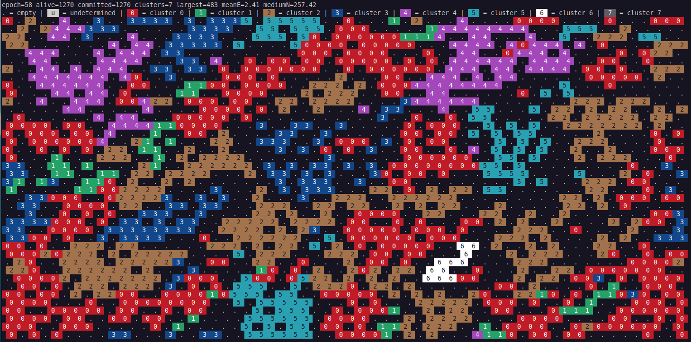

# Evoscope

*A minimal multicellular simulation framework for emergent mesoscopic organization and latent-state discovery.*

---

**Evoscope** is a minimal computational framework for studying how multicellular organization, morphology, and functional diversity can emerge from compact regulatory rules in a dissipative environment.

The project is built around a spatial agent-based model in which cells evolve on a toroidal hexagonal lattice coupled to a nutrient field. Each cell is governed by a small regulatory program controlling nutrient uptake, adhesion, motility, competition, protection, and identity commitment. Despite this minimal design, the system generates rich multicellular behaviors including aggregate formation, territorial expansion, differentiated colonies, ecological trade-offs, collective movement, and eventual collapse under stress.

A central idea behind Evoscope is that multicellular form is not just a visible outcome, but a **mesoscopic state** linking intracellular regulation to tissue-scale organization. To explore this, Evoscope also serves as a controlled testbed for **representation learning**: autoencoders are trained on simulation snapshots to test whether morphology alone contains enough information to recover hidden internal regulatory structure.

In this sense, Evoscope serves two purposes at once:

- a minimal sandbox for emergent multicellular dynamics;
- a synthetic benchmark for testing whether latent-variable models can identify mesoscopic structure in systems where the internal rules are known.

More broadly, the project is motivated by the hypothesis that if these approaches work in a fully controlled synthetic system, they may also become useful in real biological settings where sufficiently rich paired morphological and spatial-transcriptomic data are available.

The model combines:

- heritable identity commitment
- nutrient-dependent regulation
- adhesion, motility, competition, and protection
- local killing and space clearing
- emergent multicellular morphologies
- morphology-to-state inference through autoencoder-based latent representations

Rather than modeling a specific organism, Evoscope provides a **minimal regulatory sandbox** for exploring how structured multicellular behaviors can arise from interpretable local rules.

---



## Concept

Evoscope was developed to investigate a specific question:

> Can a minimal multicellular system generate a biologically interpretable **mesoscopic level of organization** linking intracellular regulatory programs to transient colony-level structure?

The simulation represents cells as agents on a **toroidal hexagonal lattice** coupled to a shared nutrient field.

## What Evoscope simulates

Evoscope models a population of cells that:

- live on a toroidal hexagonal lattice
- consume and compete for diffusible nutrients
- proliferate, die, move, and interact locally
- commit to heritable identity states
- form differentiated clusters with distinct collective behaviors

These interactions give rise to dynamic multicellular regimes rather than static structures: colonies form, expand, specialize, compete, drift, and eventually dissolve as ecological constraints accumulate.

---

## Main features

- 2D toroidal hexagonal grid
- one cell per lattice site
- diffusive extracellular nutrient field
- intracellular energy bookkeeping
- minimal gene/protein regulatory system
- stochastic commitment to cluster identity
- division, movement, attack, death, and nutrient recycling
- ASCII rendering of simulation states
- exportable outputs for downstream quantitative analysis
- support for morphology-to-state learning with convolutional autoencoders

---

## Why this project matters

Evoscope is not intended to reproduce a specific organism. Instead, it asks a more fundamental question:

"Can a minimal regulatory grammar generate multicellular states rich enough to be both biologically interesting and computationally learnable?"

This makes Evoscope useful both for theoretical biology and for developing machine-learning strategies aimed at connecting morphology, regulation, and latent mesoscopic structure.
---

## Installation

Clone the repository and install the required Python packages.

```Bash
git clone https://github.com/<your-username>/evoscope.git
cd evoscope
pip install -r requirements.txt
```

A minimal requirements.txt can include:

```Bash
numpy
matplotlib
pandas
torch
```

If you only want to run the simulator and not the autoencoder analysis, torch is optional.

## Running the simulation

```Bash
python evoscope.py
```

If argument parsing is enabled in your current version, a typical command may look like:

```Bash
python evoscope.py --width 60 --height 40 --seed 42 --epochs 150 --initial_cells 30 --nutrient 6.9
```

Outputs may include:

- console summaries
- ASCII frame dumps
- snapshot arrays
- global gene trajectories
- cluster-resolved gene trajectories

### Example output

Typical simulation dynamics include:

-sparse exploratory cells
-early nucleation of committed clusters
-coexistence of multiple multicellular domains
-competitive reshaping of territorial interfaces
-fragmentation and collapse under energetic stress


The system is intentionally minimal, but it often produces visually rich and interpretable multicellular behaviors.


### Multi-run aggregation

The repository may include utilities for aggregating results across multiple seeds.

For example:

```Bash
python aggregate_evoscope_fig4.py --root runs --outdir aggregated_outputs
```

This can be used to compute:

- mean ± standard deviation of global gene trajectories
- mean ± standard deviation of cluster-resolved gene trajectories
- multi-experiment summary figures

## Representation learning

Evoscope also supports a morphology-to-state workflow in which simulation snapshots are used to train convolutional autoencoders with supervised prediction heads.

The goal is to test whether:

- visible morphology contains recoverable information about hidden internal states
- latent variables can serve as mesoscopic coordinates linking internal regulatory dynamics to emergent multicellular form

This part of the project is intended as a proof of concept for broader applications in:

- digital pathology
- spatial transcriptomics
- synthetic morphogenesis
- interpretable biological representation learning


## Scientific context

Evoscope builds on established traditions in:

- agent-based multicellular modeling
- minimal self-organizing systems
- dissipative biological organization
- artificial life
- latent representation learning

Its contribution is not to reproduce full biochemical realism, but to provide an original minimal integration of:

- regulatory commitment
- ecological interaction
- dissipative multicellular dynamics
- morphology-to-state inference

tailored to the mesoscopic question.

## Status

This project is currently under active development.

At present, Evoscope should be viewed as:

- a research prototype
- a conceptual and computational sandbox
- a platform for testing mesoscopic hypotheses

rather than a calibrated model of any specific tissue or organism.

## Preprint

A preprint describing the framework is planned / available as:

Luca Zammataro. A Minimal Regulatory Spatial Model for Emergent Multicellular Organization in Dissipative Environments.

(A bioRxiv entry will be added here after public release soon).

## Citation

If you use this code, please cite the associated preprint once available.

(A BibTeX entry will be added here after public release soon).

## License

MIT

Add the corresponding LICENSE file before making the repository public.

## Contact

Luca Zammataro
lucazammataro@lunanfoldomicsllc.com  - Lunan Foldomics LLC - github.com/lunanfoldomics
