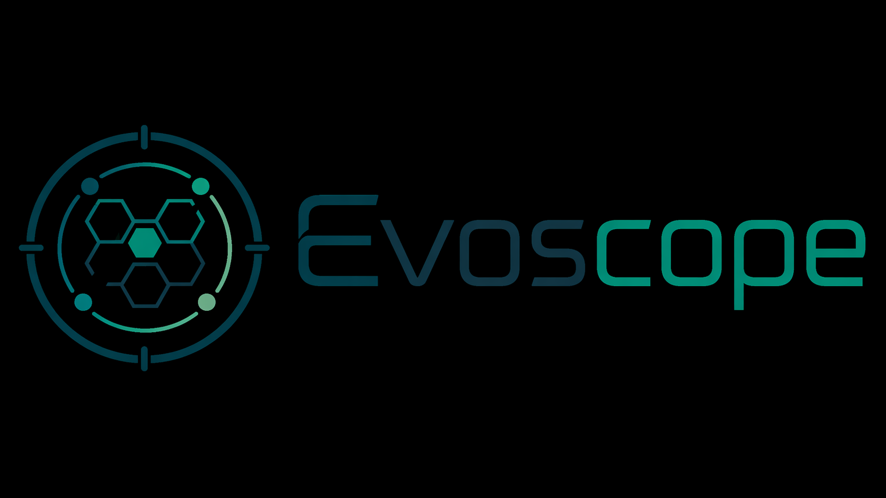
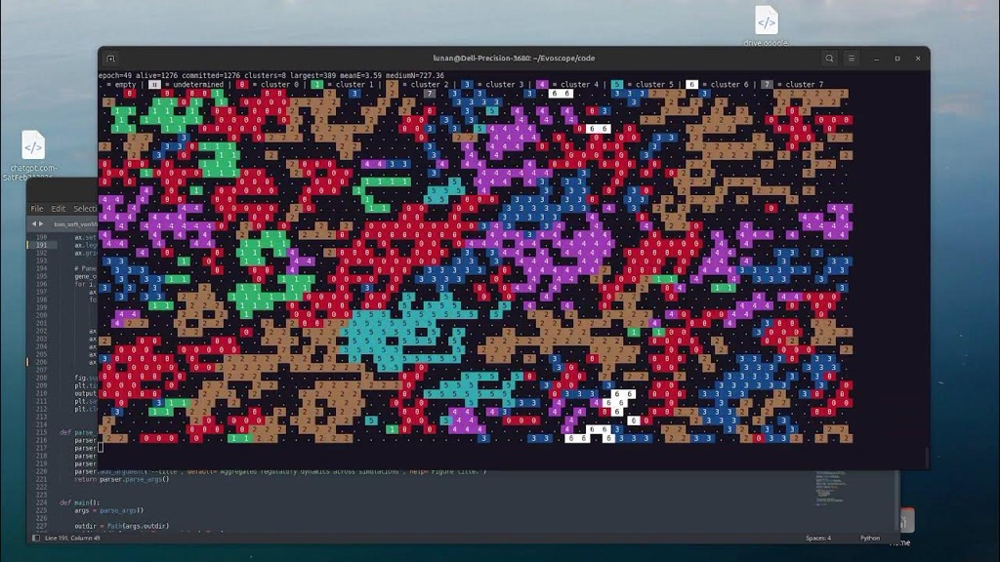
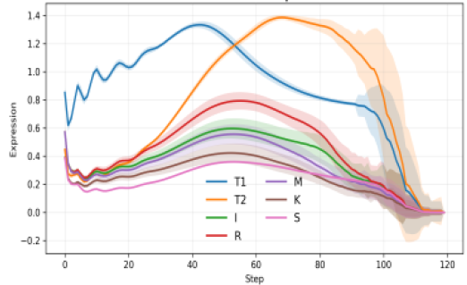
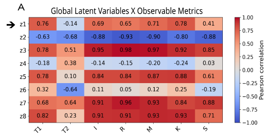
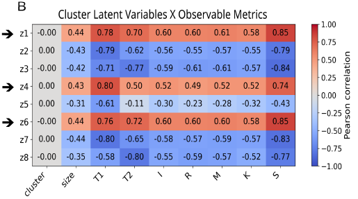

# Evoscope

*A minimal multicellular simulation framework for emergent mesoscopic organization and latent-state discovery.*

---

**Evoscope** is a minimal computational framework for studying how multicellular organization, morphology, and functional diversity can emerge from compact regulatory rules in a dissipative environment.

The framework is built around a spatial agent-based model in which cells evolve on a toroidal hexagonal lattice coupled to a nutrient field. Each cell is governed by a compact regulatory program controlling nutrient uptake, adhesion, motility, competition, protection, and identity commitment. Despite this minimal design, the system generates rich multicellular behaviors, including aggregate formation, territorial expansion, differentiated colonies, ecological trade-offs, collective movement, and eventual collapse under stress.

A central idea behind Evoscope is that multicellular form is not merely a visible outcome, but a **mesoscopic state** linking intracellular regulation to tissue-scale organization. To explore this, Evoscope also serves as a controlled testbed for **representation learning**: autoencoders are trained on simulation snapshots to test whether morphology alone contains enough information to recover hidden internal regulatory structure.

In this sense, Evoscope serves two purposes at once:

- a minimal sandbox for emergent multicellular dynamics;
- a synthetic benchmark for testing whether latent-variable models can identify mesoscopic structure in systems where the internal rules are known.

More broadly, the project is motivated by the hypothesis that if these approaches work in a fully controlled synthetic system, they may also become useful in real biological settings where sufficiently rich paired morphological and spatial-transcriptomic data are available.

The model combines:

- heritable identity commitment;
- nutrient-dependent regulation;
- adhesion, motility, competition, and protection;
- local killing and space clearing;
- emergent multicellular morphologies;
- morphology-to-state inference through autoencoder-based latent representations.

Rather than modeling a specific organism, Evoscope provides a **minimal regulatory sandbox** for exploring how structured multicellular behaviors can arise from interpretable local rules.

---

## Concept

Evoscope was developed to investigate a specific question:

> Can a minimal multicellular system generate a biologically interpretable **mesoscopic level of organization** linking intracellular regulatory programs to transient colony-level structure?

The simulation represents cells as agents on a **toroidal hexagonal lattice** coupled to a shared nutrient field. Each cell carries a compact internal regulatory program that biases its local behavior and long-term identity.

---

## Demo video

Video overview:  
https://www.youtube.com/watch?v=tgj-fxmyyas

[](https://www.youtube.com/watch?v=tgj-fxmyyas)

---

## What Evoscope simulates

Evoscope models a population of cells that:

- live on a toroidal hexagonal lattice;
- consume and compete for diffusible nutrients;
- proliferate, die, move, and interact locally;
- commit to heritable identity states;
- form differentiated clusters (numbered from 0 to 7) with distinct collective behaviors.

These interactions give rise to dynamic multicellular regimes rather than static structures: colonies form, expand, specialize, compete, drift, and eventually dissolve as ecological constraints accumulate.

---

## Main features

- 2D toroidal hexagonal grid;
- one cell per lattice site;
- diffusive extracellular nutrient field;
- intracellular energy bookkeeping;
- minimal gene/protein regulatory system;
- stochastic commitment to cluster identity;
- division, movement, attack, death, and nutrient recycling;
- ASCII rendering of simulation states;
- exportable outputs for downstream quantitative analysis;
- support for morphology-to-state learning with convolutional autoencoders.

---

## Why this project matters

Evoscope was designed to build a synthetic multicellular world that is simple enough to remain interpretable, yet rich enough to generate structured morphodynamic regimes that can be learned by convolutional encoders.

It is not intended to reproduce any specific organism. Instead, it asks a more fundamental question:

> Can a minimal regulatory grammar generate multicellular states rich enough to be both biologically meaningful and computationally learnable?

This makes Evoscope relevant both to theoretical biology and to the development of machine-learning strategies aimed at connecting morphology, regulation, and latent mesoscopic structure.

---

## Repository structure

A typical repository layout may include:

- `code/` — simulation, aggregation, and autoencoder scripts;
- `images/` — logos, thumbnails, and illustrative figures;
- `runs/` — simulation outputs from batch experiments;
- `aggregated_outputs/` — summary results across multiple seeds.

Adapt these paths as needed for your local setup.

---

## Conda environment

You can also create a Conda environment for Evoscope:

```bash
conda env create -f environment.yml
conda activate evoscope
```

If you prefer, you can install the dependencies with pip instead:

```bash
pip install -r requirements.txt
```

---

## Installation

Clone the repository and install the required Python packages:

```bash
git clone https://github.com/lunanfoldomics/evoscope.git
cd evoscope
pip install -r requirements.txt
```

A minimal requirements.txt can include:

```Bash
# Evoscope dependencies
numpy>=1.23
matplotlib>=3.6
pandas>=1.5
torch>=2.0
```

If you only want to run the simulator and not the autoencoder analysis, torch is optional.

## Running the simulation

```Bash
mkdir myrun
cd myrun
python ../code/evoscope.py
```

If argument parsing is enabled in your current version, a typical command may look like:

```Bash
python ../code/evoscope.py --width 60 --height 40 --seed 42 --epochs 150 --initial_cells 30 --nutrient 6.9
```

Outputs may include:

- console summaries
- ASCII frame dumps
- snapshot arrays
- global gene trajectories
- cluster-resolved gene trajectories

### Example output

Typical simulation dynamics include:

- sparse exploratory cells
- early nucleation of committed clusters
- coexistence of multiple multicellular domains
- competitive reshaping of territorial interfaces
- fragmentation and collapse under energetic stress


The system is intentionally minimal, but it often produces visually rich and interpretable multicellular behaviors.

### Multi-run aggregation

Evoscope also supports aggregation across multiple independent simulation seeds.

For example, you can run 100 runs with:

```Bash
bash ../code/run_evoscope_batch.sh 100 150 60 40 runs
```

and you can aggregate results with:

```Bash
python ../code/aggregate_evoscope.py --root runs --outdir aggregated_outputs
```

This can be used to compute:

- mean ± standard deviation of global gene trajectories
- mean ± standard deviation of cluster-resolved gene trajectories
- multi-experiment summary figures

### Example aggregation outputs

A representative example is shown below for the **global regulatory variables**, where mean ± standard deviation trajectories are computed across repeated runs. These aggregated trends show that the framework produces reproducible temporal programs rather than purely idiosyncratic single-run behavior.



*Figure. Representative aggregated trajectories of the global regulatory variables across multiple independent simulations. Solid lines indicate mean expression across runs, and shaded regions indicate ±1 standard deviation. Cluster-resolved trajectories are presented in the associated preprint.*

---

## Autoencoders

Evoscope supports two autoencoder workflows for latent-variable discovery:

* **global-gene mode**
* **cluster-gene mode**

### Global-gene mode

```bash
python ../code/torhex_autoencoder.py \
    --snapshots_dir snapshots \
    --global_csv global_genes.csv \
    --target_mode global \
    --epochs 100
```

### Cluster-gene mode

```bash
python ../code/torhex_autoencoder.py \
    --snapshots_dir snapshots \
    --cluster_csv cluster_genes.csv \
    --target_mode cluster_flat \
    --epochs 100
```

### Latent–gene correlation analysis

Each autoencoder run produces an output folder named `ae_output`. Rename it according to the workflow:

* `global_ae_outputs` for global-gene runs
* `cluster_ae_outputs` for cluster-gene runs

Then run the correlation script.

**Global-gene correlation**

```bash
python ../code/correlation_global-or-cluster_latents_and_genes.py \
    --latents global_ae_outputs/latents.csv \
    --metrics global_genes.csv
```

**Cluster-gene correlation**

```bash
python ../code/correlation_global-or-cluster_latents_and_genes.py \
    --latents cluster_ae_outputs/latents.csv \
    --metrics cluster_genes.csv
```

This analysis typically produces:
- correlation tables linking latent coordinates to gene-level observables;
- heatmap visualizations summarizing latent–observable relationships;
- output files that can be compared across independent simulation seeds.

### Example correlation outputs

Representative examples of latent–gene correlation heatmaps are shown below for the global-gene and cluster-gene workflows.





This workflow produces correlation tables and heatmap visualizations that summarize the relationship between learned latent coordinates and observable regulatory variables. Representative examples from the Evoscope analyses are shown above and are discussed further in the associated preprint.

---
## Status

This project is currently under active development.

At present, Evoscope should be viewed as:

- a research prototype
- a conceptual and computational sandbox
- a platform for testing mesoscopic hypotheses

rather than a calibrated model of any specific tissue or organism.

## Preprint

A preprint describing the framework is planned / available as:

Luca Zammataro. A Minimal Regulatory Spatial Model for Emergent Multicellular Organization in Dissipative Environments.

(A bioRxiv entry will be added here after public release soon).

## Citation

If you use this code, please cite the associated preprint once available.

(A BibTeX entry will be added here after public release soon).

## License

MIT

Add the corresponding LICENSE file before making the repository public.

## Contact

Luca Zammataro
lucazammataro@lunanfoldomicsllc.com  - Lunan Foldomics LLC - github.com/lunanfoldomics
